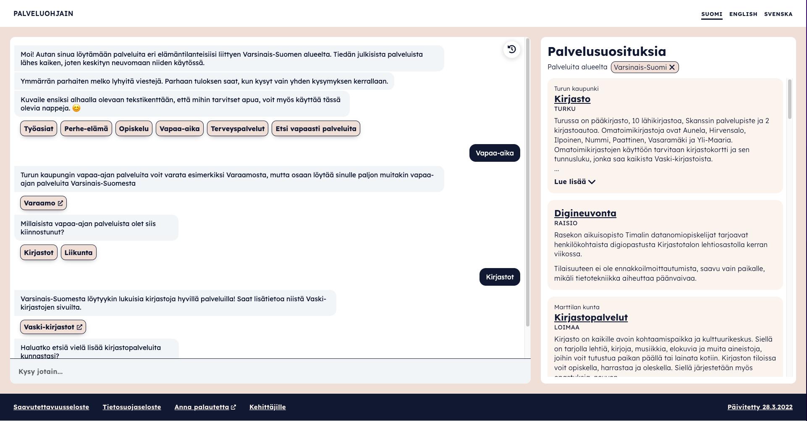

# Palveluohjain - Dokumentaatio <!-- omit in toc -->

Palveluohjain on avoimen lähdekoodin RASA-bottiin pohjautuva tekoälysovellus, joka tuottaa palveluehdotuksia käyttäjän kanssa käytyjen keskustelujen perusteella. Palvelutietovarantona toimii Suomi.fi-palvelutietovaranto.

Palveluohjainbotti on tuotettu Turun kaupungin ja Varsinais-Suomen Sairaanhoitopiirin yhteishankkeena Valtiovarainministeriön rahoituksella.

> Tutustu [Palveluohjainta esittelevään Power Point -esitykseen](/.attachments/bottiesittely.pptx). (Sama esitys löytyy myös [PDF-muodossa](/.attachments/bottiesittely.pdf)).

Palveluohjaimen käyttöliittymä (_keväällä 2022_):

---

### Dokumentaation sisältö

- [Arkkitehtuuri](arkkitehtuuri.md)
- [Azure- ja infra-arkkitehtuuri](azure-arkkitehtuuri.md)
- [Design ja saavutettavuus](design-ja-saavutettavuus.md) -sivulta löytyvät mm. Palveluohjaimen "logot"
- [Jatkokehitys (ideoita)](/jatkokehitys/README.md)
- [Julkaisut (release notes)](julkaisut-release-notes.md)
- [Ohjeet](ohjeet/README.md)
  - [Bottikuiskaajan opas](ohjeet/bottikuiskaajan-opas.md)
  - [Käyttöönotto muualla](ohjeet/kayttoonotto-muualla.md)
  - [Ohjaus palveluun esim. kunnan sivuilta](ohjeet/palveluun-linkitys.md)
  - [Palveluohjaimen ylläpito](ohjeet/yllapito.md)
- [Palvelusuosittelijan toiminta](palvelusuosittelijan-toiminta/README.md)
- [Repositoriot ja kehityskäytännöt (englanniksi)](repositories-and-dev-practices.md)
- [Tietoturva ja tietosuoja](tietoturva-ja-tietosuoja.md)

## Mistä aloittaa? Jos olet...

### Kiinnostunut ottamaan palveluohjaimen käyttöön

- Ja haluaisit ohjata kuntalaisesi palveluohjaimeen, tutustu ohjeeseen [palveluun ohjaaminen esim. kunnan sivuilta](ohjeet/palveluun-linkitys.md)
- Ja haluat pystyttää oman instanssin palvelusta, aloita sivulta [käyttöönotto muualla](ohjeet/kayttoonotto-muualla.md)

### Ylläpitäjille

- Chatbotin ylläpitoon ja kehittämiseen löytyy ohjeita [bottikuiskaajan oppaasta](ohjeet/bottikuiskaajan-opas.md)

- Muiden komponenttien ylläpitäjille hyödyllisiä voisivat olla:
  - [Palveluohjaimen ylläpito-ohjeissa](ohjeet/yllapito.md) kerrotaan teknisten komponenttien ylläpitotarpeista
  - [Arkkitehtuuri](arkkitehtuuri.md) (yleistason kuvaus)
  - [Azure- ja infra-arkkitehtuuri](azure-arkkitehtuuri.md)
  - [Repositories and development practices](/repositories-and-dev-practices.md)

## Palveluohjaimen komponentit

Palveluohjaimen eri komponentit ja työkalut jakautuvat seuraaviin yhdeksään repositorioon:

- [PaohAzureInfra](https://github.com/City-of-Turku/PaohAzureInfra) sisältää Bicep-templatet Palveluohjaimen Azure-resurssien pystyttämiseen
- [PaohBotfront](https://github.com/City-of-Turku/PaohBotfront) on chatbotin ylläpitoon käytettävä työkalu, jota on tämän projektin puitteissa muokattu ja jatkokehitetty
- [PaohBotfrontChatbotProject](https://github.com/City-of-Turku/PaohBotfrontChatbotProject) sisältää Rasa-pohjaisen chatbotin
- [PaohRasaForBotfront](https://github.com/City-of-Turku/PaohRasaForBotfront)
- [PaohRasaPlatform](https://github.com/City-of-Turku/PaohRasaPlatform)
- [PaohServiceDataImport](https://github.com/City-of-Turku/PaohServiceDataImport) palveluiden hausta (palvelusuosittelijan käyttöön) vastaava palvelu
- [PaohServiceMatchEngine](https://github.com/City-of-Turku/PaohServiceMatchEngine) Palveluohjaimen "taustamoottorina" toimiva palvelusuosittelija
- [PaohWebFrontend](https://github.com/City-of-Turku/PaohWebFrontend) sisältää [palveluohjaaja.fi:ssä](https://palveluohjaaja.fi) nähtävän web-käyttöliittymän
- [PaohYTRServiceDataImport](https://github.com/City-of-Turku/PaohYTRServiceDataImport) palveluiden hakemiseen Kompassi-YTR:stä (ei aktiivikäytössä)
- [rasa-webchat](https://github.com/City-of-Turku/rasa-webchat) sisältää chatwidgetin, jonka kautta käyttäjä keskustelee botin kanssa verkkosivulla
